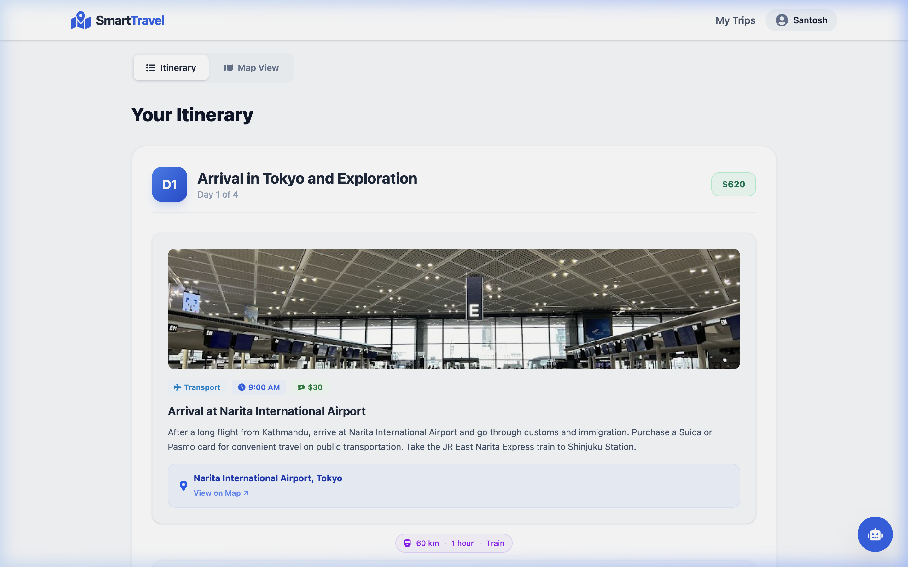

<div align="center">

# ✈️ SmartTravel

### AI-Powered Travel Itinerary Generator

Generate personalized, day-by-day travel plans in seconds — complete with budget breakdowns, live weather, interactive maps, and one-click PDF exports.

🌐 **Live Demo →** [smart-travel-planner-app.vercel.app](https://smart-travel-planner-app.vercel.app)

[](https://react.dev/)
[](https://vite.dev/)
[](https://tailwindcss.com/)
[](https://nodejs.org/)
[](https://www.mongodb.com/atlas)
[](LICENSE)

</div>

---

## 📸 Screenshots

<div align="center">

| Home — Trip Planning Form | Day-by-Day Itinerary |
|:---:|:---:|
|  |  |

| Budget Breakdown Charts | Saved Trips Dashboard |
|:---:|:---:|
|  |  |

<details>
<summary><strong>View Results Page</strong></summary>


</details>

</div>

---

## ✨ Features

### 🤖 AI Itinerary Generation
- **Dual-LLM Architecture** — Uses **Groq LLaMA 3.3 70B** as the primary engine for ultra-fast responses (~1-2s), with automatic fallback to **Google Gemini 1.5 Flash** if Groq is unavailable. Both providers include exponential retry logic for rate-limit resilience.
- **Structured JSON Output** — AI returns strictly typed JSON itineraries with day-wise activities, estimated costs in USD, travel logistics between stops, and practical travel tips.
- **Personalized Plans** — Select travel type (Solo, Couple, Friends, Family), interests (Food, Adventure, History, Nightlife, Nature, Shopping), and budget tier (Budget, Moderate, Luxury) for tailored recommendations.
- **Origin-Destination Routing** — Specify a departure city for realistic Day 1 arrival logistics.

### 💬 AI Chat Assistant
- **Floating Chatbot** — Persistent chat widget accessible on every page for instant travel Q&A, recommendations, and tips.
- **Conversational Memory** — Maintains chat history within the session for contextual follow-up questions.
- **Dual-Provider Fallback** — Chat uses Groq as primary for speed, falling back to Gemini if needed.

### 🗺️ Maps & Location
- **Google Places Autocomplete** — Real-time city suggestions as you type in both origin and destination fields.
- **Interactive Google Map** — Embedded map with geocoded destination markers on the results page.
- **Google Geocoding** — Automatic latitude/longitude resolution for every destination.

### 🌤️ Live Weather
- **5-Day Forecast** — Real-time weather data from OpenWeatherMap displayed alongside itinerary results, including temperature, humidity, wind speed, and conditions.

### 📊 Budget & Analytics
- **Visual Budget Breakdown** — Recharts-powered pie/bar charts showing cost allocation across accommodation, food, transportation, activities, and miscellaneous.
- **Per-Day Cost Tracking** — Each day shows an estimated daily cost, with a total trip cost summary.

### 🖼️ Smart Image Engine
- **Multi-Provider Image Cascade** — Fetches contextually relevant photos from Pexels, Unsplash, and Pixabay with intelligent relevance scoring and category-aware keyword matching.
- **Anti-Duplicate System** — Per-trip session tracking ensures no two activity cards show the same image, with 24-hour caching for performance.
- **Google Places Photos** — Destination-level imagery sourced directly from Google Places API.

### 🔐 Authentication & Security
- **Dual Auth** — Traditional email/password registration with bcrypt (12 rounds) hashing, plus one-click Google OAuth 2.0 sign-in.
- **JWT Sessions** — 30-day token expiry with real-time client-side expiration checks via `jwt-decode`, plus global Axios interceptors that auto-logout on 401 responses.
- **API Hardening** — Helmet for HTTP security headers, CORS whitelisting, and granular rate limiting (5 req/min for generation, 20 req/min for chat, 15 req/15min for auth).

### 📁 Trip Management
- **Save & View** — Authenticated users can save generated itineraries to MongoDB and browse them in a searchable dashboard.
- **Duplicate Trips** — One-click regeneration with the same parameters but a fresh AI-generated plan.
- **Delete Trips** — Remove saved trips with confirmation dialogs.
- **Shareable Links** — Public `/trip/:id` routes allow sharing itineraries with anyone, no login required.

### 📤 Export & Sharing
- **PDF Export** — Download the complete itinerary as a formatted A4 PDF using html2pdf.js with CORS-safe image rendering.
- **Share Links** — Copy a shareable URL to send your trip to friends.

### 🎨 User Experience
- **Animated Loading States** — Travel-themed loading animations (AnimatedLoader) and skeleton screens while AI generates results.
- **Sample Trips** — Pre-built itinerary previews (Kathmandu, Manali, Tokyo, Paris) on the home page for instant exploration.
- **Framer Motion Animations** — Smooth page transitions, card animations, and micro-interactions throughout the app.
- **Toast Notifications** — Real-time feedback via react-hot-toast for all user actions.
- **404 Page** — Custom not-found page with navigation back to home.

---

## 🛠️ Tech Stack

### Frontend

| Technology | Purpose |
|:---|:---|
| [React 19](https://react.dev/) | UI framework with hooks and context API |
| [Vite 8](https://vite.dev/) | Build tool and dev server with HMR |
| [Tailwind CSS v4](https://tailwindcss.com/) | Utility-first CSS framework via `@tailwindcss/vite` plugin |
| [React Router v7](https://reactrouter.com/) | Client-side routing with protected routes |
| [Framer Motion](https://www.framer.com/motion/) | Declarative animations and page transitions |
| [Recharts](https://recharts.org/) | Budget breakdown charts (pie, bar) |
| [Axios](https://axios-http.com/) | HTTP client with request/response interceptors |
| [@react-google-maps/api](https://www.npmjs.com/package/@react-google-maps/api) | Google Maps embed and markers |
| [@react-oauth/google](https://www.npmjs.com/package/@react-oauth/google) | Google OAuth 2.0 login flow |
| [html2pdf.js](https://ekoopmans.github.io/html2pdf.js/) | Client-side PDF generation |
| [react-hot-toast](https://react-hot-toast.com/) | Toast notification system |
| [react-icons](https://react-icons.github.io/react-icons/) | Icon library (FontAwesome set) |
| [jwt-decode](https://www.npmjs.com/package/jwt-decode) | Client-side JWT token expiration checks |

### Backend

| Technology | Purpose |
|:---|:---|
| [Express.js](https://expressjs.com/) | REST API framework |
| [Mongoose](https://mongoosejs.com/) | MongoDB ODM with schema validation |
| [Groq SDK](https://console.groq.com/) | Primary AI — LLaMA 3.3 70B Versatile |
| [@google/generative-ai](https://ai.google.dev/) | Fallback AI — Gemini 1.5 Flash |
| [bcryptjs](https://www.npmjs.com/package/bcryptjs) | Password hashing (12-round salt) |
| [jsonwebtoken](https://www.npmjs.com/package/jsonwebtoken) | JWT token signing and verification |
| [google-auth-library](https://www.npmjs.com/package/google-auth-library) | Google OAuth token verification |
| [Helmet](https://helmetjs.github.io/) | HTTP security headers |
| [express-rate-limit](https://www.npmjs.com/package/express-rate-limit) | API rate limiting per endpoint |
| [dotenv](https://www.npmjs.com/package/dotenv) | Environment variable management |

### Infrastructure

| Service | Purpose |
|:---|:---|
| [MongoDB Atlas](https://www.mongodb.com/atlas) | Cloud database (Users, Trips collections) |
| [Vercel](https://vercel.com/) | Frontend deployment with SPA rewrites |
| [Render](https://render.com/) | Backend API deployment |

---

## 🏗️ Architecture

```
┌──────────────────────────────────────────────────────────────────────┐
│                         React Frontend (Vite)                        │
│                                                                      │
│  Pages:  Home · Results · Dashboard · Login · Register · NotFound    │
│                                                                      │
│  Components:  TripForm · ItineraryCard · BudgetBreakdown · TripMap   │
│               WeatherCard · ChatBot · SampleTrips · ActivityImage    │
│               AnimatedLoader · TravelLogistics · Navbar · Footer     │
│                                                                      │
│  State:  AuthContext (JWT + Google OAuth) · Axios Interceptors       │
└─────────────────────────────────┬────────────────────────────────────┘
                                  │ REST API (Axios)
┌─────────────────────────────────┼────────────────────────────────────┐
│                       Express Backend                                │
│                                                                      │
│  Routes:        /api/auth    → Register, Login, Google OAuth         │
│                 /api/trips   → Generate, Save, CRUD, Chat, Share     │
│                 /api/places  → Autocomplete                          │
│                 /api/place-image · /api/activity-image                │
│                                                                      │
│  Middleware:    JWT Auth Guard · Helmet · CORS · Rate Limiters        │
│                                                                      │
│  Services:     Gemini AI · Groq AI · Weather · Maps · Places         │
│                Image Service (Pexels + Unsplash + Pixabay)           │
└─────────────────────────────────┬────────────────────────────────────┘
                                  │
                    ┌─────────────┴─────────────┐
                    │      MongoDB Atlas         │
                    │   Users · Trips            │
                    └───────────────────────────┘
```

---

## 🚀 Getting Started

### Prerequisites

- **Node.js** v18 or higher
- **MongoDB Atlas** cluster ([free tier](https://www.mongodb.com/atlas))
- API keys (all have free tiers):

| Service | Get Key At | Required For |
|:---|:---|:---|
| Groq | [console.groq.com](https://console.groq.com/) | AI itinerary generation (primary) |
| Google AI Studio | [aistudio.google.com](https://aistudio.google.com/) | AI fallback (Gemini) |
| Google Cloud | [console.cloud.google.com](https://console.cloud.google.com/) | Maps, Places, Geocoding, OAuth |
| OpenWeatherMap | [openweathermap.org/api](https://openweathermap.org/api) | Weather forecasts |
| Pexels | [pexels.com/api](https://www.pexels.com/api/) | Activity images (optional) |
| Unsplash | [unsplash.com/developers](https://unsplash.com/developers) | Activity images (optional) |

### 1. Clone the Repository

```bash
git clone https://github.com/Santosh-Shahh/Smart-Travel-Planner.git
cd Smart-Travel-Planner
```

### 2. Backend Setup

```bash
cd backend
npm install
cp .env.example .env
```

Configure `backend/.env`:

```env
MONGO_URI=mongodb+srv://<user>:<pass>@cluster.mongodb.net/travel-planner
JWT_SECRET=your_jwt_secret
GROQ_API_KEY=gsk_xxxxxxxxxxxx
GEMINI_API_KEY=AIzaXXXXXXXXXXXX
GOOGLE_MAPS_API_KEY=AIzaXXXXXXXXXXXX
OPENWEATHER_API_KEY=xxxxxxxxxxxx
GOOGLE_CLIENT_ID=xxxxxxxxxxxx.apps.googleusercontent.com
PEXELS_API_KEY=xxxxxxxxxxxx          # Optional
UNSPLASH_ACCESS_KEY=xxxxxxxxxxxx     # Optional
PORT=5001
```

Start the backend:

```bash
npm run dev        # Development (nodemon auto-reload)
npm start          # Production
```

### 3. Frontend Setup

```bash
cd frontend
npm install
cp .env.example .env
```

Configure `frontend/.env`:

```env
VITE_API_URL=http://localhost:5001/api
VITE_GOOGLE_CLIENT_ID=your_google_client_id_here
```

Start the frontend:

```bash
npm run dev
```

### 4. Open in Browser

Navigate to **http://localhost:5173** and start planning your trip!

---

## 📁 Project Structure

```
Smart-Travel-Planner/
├── backend/
│   ├── config/
│   │   └── db.js                     # MongoDB Atlas connection
│   ├── middleware/
│   │   └── auth.js                   # JWT verification guard
│   ├── models/
│   │   ├── User.js                   # User schema (email + Google OAuth)
│   │   └── Trip.js                   # Trip schema (itinerary, weather, places)
│   ├── routes/
│   │   ├── auth.js                   # POST register, login, google
│   │   └── trips.js                  # POST generate, save, duplicate, chat
│   │                                 # GET list, get by id, shared
│   │                                 # DELETE by id
│   ├── services/
│   │   ├── gemini.js                 # Groq (primary) + Gemini (fallback) AI
│   │   ├── imageService.js           # Multi-provider image engine
│   │   ├── maps.js                   # Google Geocoding API
│   │   ├── places.js                 # Google Places search + autocomplete
│   │   └── weather.js                # OpenWeatherMap 5-day forecast
│   ├── server.js                     # Express entry point
│   ├── .env.example
│   └── package.json
│
├── frontend/
│   ├── src/
│   │   ├── api/
│   │   │   └── axios.js              # Axios instance + JWT interceptors
│   │   ├── components/
│   │   │   ├── ActivityImage.jsx      # Smart image fetching per activity
│   │   │   ├── AnimatedLoader.jsx     # Travel-themed loading animation
│   │   │   ├── BudgetBreakdown.jsx    # Recharts budget visualization
│   │   │   ├── ChatBot.jsx            # Floating AI chat assistant
│   │   │   ├── Footer.jsx             # Site footer
│   │   │   ├── ItineraryCard.jsx      # Day-wise activity cards
│   │   │   ├── LoadingSkeleton.jsx    # Skeleton loading states
│   │   │   ├── LoadingSpinner.jsx     # Simple spinner component
│   │   │   ├── Navbar.jsx             # Navigation bar with auth state
│   │   │   ├── PlaceImage.jsx         # Google Places image component
│   │   │   ├── SampleTrips.jsx        # Pre-built itinerary previews
│   │   │   ├── TravelLogistics.jsx    # Distance & transport between stops
│   │   │   ├── TripForm.jsx           # Main trip planning input form
│   │   │   ├── TripMap.jsx            # Google Maps embed
│   │   │   └── WeatherCard.jsx        # Weather forecast display
│   │   ├── context/
│   │   │   └── AuthContext.jsx        # Auth state provider + Google OAuth
│   │   ├── hooks/
│   │   │   └── useDarkMode.js         # Dark mode toggle hook
│   │   ├── pages/
│   │   │   ├── Home.jsx               # Landing page with form + samples
│   │   │   ├── Results.jsx            # Itinerary results + map + weather
│   │   │   ├── Dashboard.jsx          # Saved trips management
│   │   │   ├── Login.jsx              # Login page
│   │   │   ├── Register.jsx           # Registration page
│   │   │   └── NotFound.jsx           # 404 page
│   │   ├── utils/
│   │   │   └── pdfExport.js           # html2pdf.js export utility
│   │   ├── App.jsx                    # Route configuration
│   │   └── main.jsx                   # React entry point
│   ├── .env.example
│   ├── vercel.json                    # SPA rewrite rules
│   └── package.json
│
├── screenshots/                       # App screenshots for README
├── .gitignore
└── README.md
```

---

## 🔄 How It Works

```
User Input                AI Generation              Data Enrichment           Presentation
───────────               ──────────────              ───────────────           ────────────
                                                      ┌ Weather API
Destination ─┐            ┌─ Groq LLaMA 3.3 ─┐       ├ Google Geocoding
Days         ├─→ Backend ─┤                   ├─→     ├ Google Places          ─→ React UI
Budget       │            └─ Gemini (fallback) ┘       └ Image Service
Travel Type ─┘                                             (Pexels/Unsplash)
Interests                 All services run
                          in parallel via
                          Promise.all()
```

1. **Input** — User enters origin, destination, duration (1–30 days), budget tier, travel type, and interests.
2. **Parallel Processing** — Backend fires AI generation, weather, places, and geocoding requests simultaneously via `Promise.all()`.
3. **AI Generation** — Groq LLaMA 3.3 70B generates a structured JSON itinerary with activities, costs, and logistics. Falls back to Gemini on failure.
4. **Enrichment** — Weather forecasts, place photos, and coordinates are fetched from external APIs concurrently.
5. **Rendering** — Frontend renders day-by-day cards with interactive elements, budget charts, weather info, and an embedded map.
6. **Persistence** — Authenticated users can save trips to MongoDB and manage them from their personal dashboard.

---

## ⚠️ Important Notes

- **Groq Free Tier** — Limited daily tokens. If rate-limited, the system automatically falls back to Gemini. For higher limits, upgrade at [console.groq.com](https://console.groq.com/settings/billing).
- **Google Maps Billing** — Maps, Places, and Geocoding APIs require a billing-enabled Google Cloud project. Restrict API keys by referrer in the Cloud Console.
- **Environment Variables** — Never commit `.env` files. The `.gitignore` is pre-configured to exclude them.
- **Image APIs (Optional)** — Pexels and Unsplash keys are optional. Without them, the app falls back to Google Places photos and generic stock images.

---

## 🔮 Future Improvements

- [ ] Flight & hotel booking integration (Skyscanner / Booking.com APIs)
- [ ] Real-time pricing for activities and accommodations
- [ ] Collaborative trip planning with shared itineraries
- [ ] Multi-language support and currency localization
- [ ] Mobile app (React Native)
- [ ] Offline itinerary access with PWA support
- [ ] Trip comparison — compare multiple AI-generated plans side by side
- [ ] User reviews & ratings for destinations and activities

---

## 🤝 Contributing

Contributions are welcome! Here's how:

1. **Fork** the repository
2. **Create** a feature branch: `git checkout -b feature/amazing-feature`
3. **Commit** your changes: `git commit -m 'feat: add amazing feature'`
4. **Push** to the branch: `git push origin feature/amazing-feature`
5. **Open** a Pull Request

---

## 📜 License

This project is licensed under the [MIT License](LICENSE).

---

<div align="center">

**Built with ❤️ by [Santosh Shah](https://github.com/Santosh-Shahh)**

If you found this project useful, please consider giving it a ⭐

</div>
