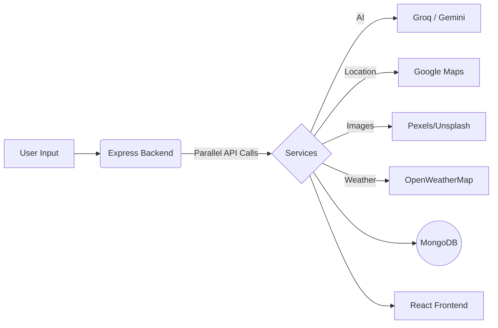

<div align="center">

# ✈️ SmartTravel
**AI-Powered Travel Itinerary Generator**

Generate personalized, day-by-day travel plans in seconds — complete with budget breakdowns, live weather, interactive maps, and one-click PDF exports.

🌐 **Live Demo →** [smart-travel-planner-app.vercel.app](https://smart-travel-planner-app.vercel.app)

[](https://react.dev/)
[](https://vite.dev/)
[](https://tailwindcss.com/)
[](https://nodejs.org/)
[](https://www.mongodb.com/atlas)

</div>

---

## 📸 Screenshots

<div align="center">

| Trip Planning Form | Day-by-Day Itinerary | Budget Breakdown |
|:---:|:---:|:---:|
|  |  |  |

</div>

---

## ✨ Key Features

- **🤖 AI-Generated Itineraries:** Powered by **Groq LLaMA 3.3 70B** (primary) and **Google Gemini 1.5 Flash** (fallback) for lightning-fast, structured JSON travel plans.
- **💬 Travel Assistant AI:** Persistent chat widget using Groq/Gemini for instant destination advice and travel tips.
- **🗺️ Interactive Maps & Routing:** Google Places Autocomplete and Maps integration for precise origin-to-destination planning and geographic context.
- **📊 Budget Analytics:** Recharts-powered interactive charts visualizing cost allocation across food, transport, stays, and activities.
- **🌤️ Live Weather Integration:** Real-time 5-day forecasts via OpenWeatherMap to help plan activities optimally.
- **🖼️ Smart Image Engine:** Multi-provider fallback cascade (Pexels, Unsplash, Pixabay, Google Places) to intelligently fetch relevant activity photos.
- **🔐 Secure Authentication:** JWT-based session management and one-click Google OAuth 2.0 integration.
- **📁 Save, Share & Export:** Manage saved trips in a dashboard, generate shareable public links, or export itineraries directly to PDF.

---

## 🛠️ Tech Stack

- **Frontend:** React 19, Vite, Tailwind CSS v4, Framer Motion, Recharts, `@react-google-maps/api`.
- **Backend:** Node.js, Express.js, Mongoose, Groq SDK, `@google/generative-ai`, JWT, Helmet.
- **Infrastructure:** MongoDB Atlas, Vercel (Frontend), Render (Backend).

---

## 🏗️ Architecture Flow



---

## 🚀 Getting Started

### Prerequisites
- Node.js v18+ and a MongoDB Atlas cluster.
- API Keys: Groq (Primary AI), Google AI Studio (Fallback AI), Google Cloud (Maps/Places/OAuth), OpenWeatherMap.

### 1. Setup Backend
```bash
git clone https://github.com/Santosh-Shahh/Smart-Travel-Planner.git
cd Smart-Travel-Planner/backend
npm install
cp .env.example .env
```
*Configure `backend/.env` with your MongoDB URI and API keys.*
```bash
npm run dev
```

### 2. Setup Frontend
```bash
cd ../frontend
npm install
cp .env.example .env
```
*Configure `frontend/.env` with your API URL (`http://localhost:5001/api`) and Google Client ID.*
```bash
npm run dev
```
Navigate to `http://localhost:5173` to view the application.

---

## 📁 Project Structure (Simplified)
```
Smart-Travel-Planner/
├── backend/
│   ├── models/           # User & Trip schemas
│   ├── routes/           # Auth & Trip REST endpoints
│   └── services/         # AI, Maps, Places, Image, Weather integration
└── frontend/
    ├── src/
    │   ├── components/   # UI elements (Forms, Maps, Charts, Chatbot)
    │   ├── context/      # JWT & Google OAuth state management
    │   └── pages/        # Dashboard, Results, Home, Auth views
    └── vercel.json       # SPA deployment config
```

---

## 🔮 Future Improvements
- Flight & hotel booking API integration (Skyscanner/Booking.com).
- Collaborative multi-user trip planning.
- Offline support via PWA.

## 🤝 Contributing
Fork the repo, create a feature branch (`git checkout -b feature/idea`), commit changes, and open a Pull Request.

---
<div align="center">
<b>Built by <a href="https://github.com/Santosh-Shahh">Santosh Shah</a></b><br>
Licensed under the MIT License
</div>
