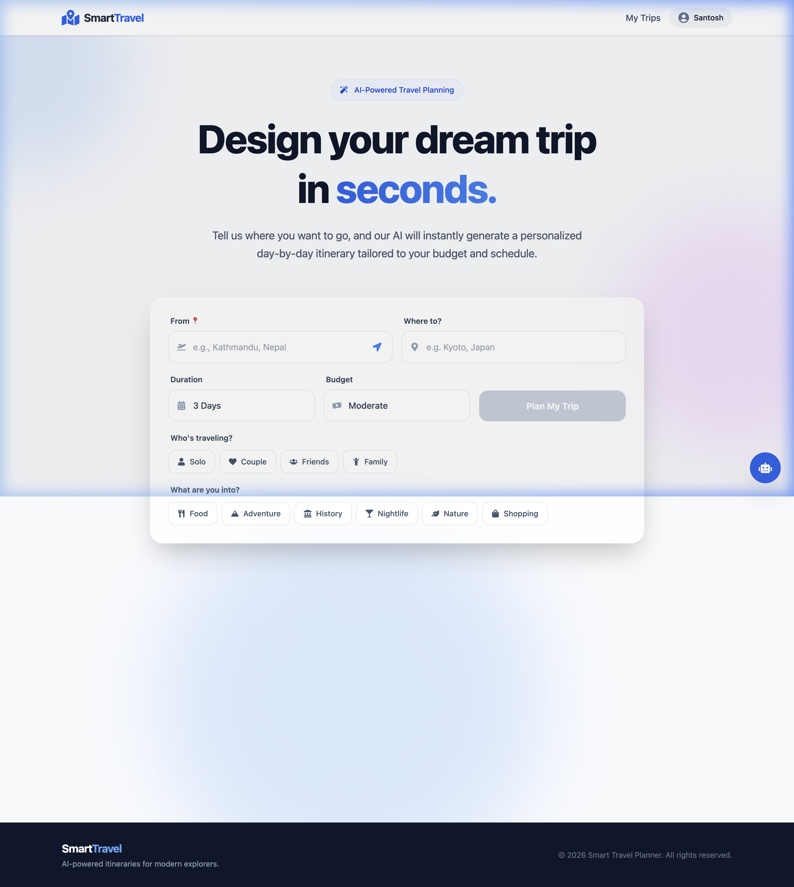
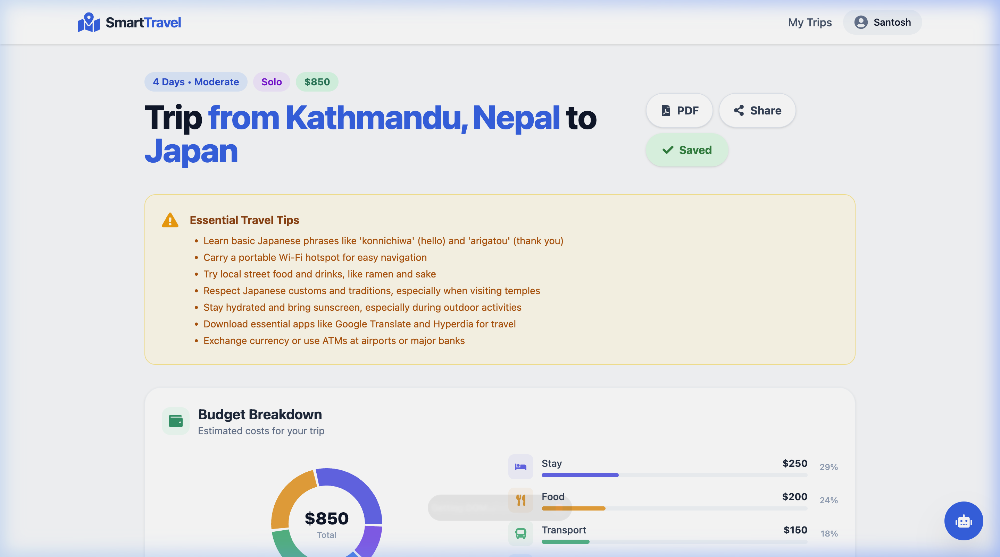
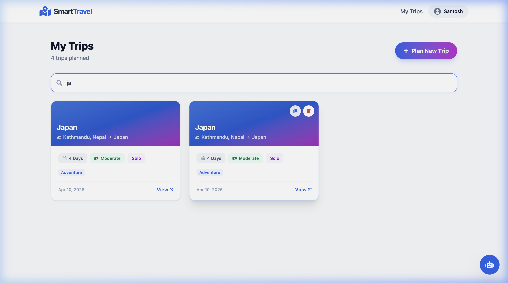
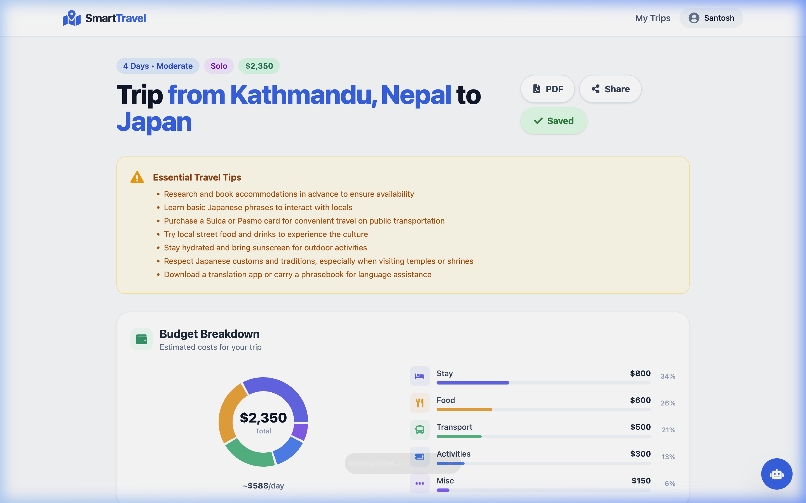

<div align="center">

# ✈️ SmartTravel

**AI-powered travel planner that generates personalized itineraries in seconds.**

[](https://react.dev/)
[](https://nodejs.org/)
[](https://www.mongodb.com/atlas)
[](https://groq.com/)
[](LICENSE)

[Features](#-features) · [Tech Stack](#-tech-stack) · [Getting Started](#-getting-started) · [Architecture](#-architecture) · [Contributing](#-contributing)

</div>

---

## 📸 Screenshots

<div align="center">

| Home | Itinerary Results |
|:---:|:---:|
|  |  |

| Trip Dashboard | Budget Breakdown |
|:---:|:---:|
|  |  |

</div>

> **Note:** Add your screenshots to a `screenshots/` directory in the project root.

---

## ✨ Features

### Core
- **AI Itinerary Generation** — Generates detailed day-by-day travel plans using Groq's LLaMA 3.3 70B model with realistic activities, timings, and local recommendations.
- **From → To Routing** — Plan trips with specific origin and destination cities for accurate travel logistics and Day 1 arrival planning.
- **Budget-Aware Planning** — Choose from Budget, Medium, or Premium tiers; the AI tailors accommodations, dining, and activities to match with estimated costs in USD.
- **Personalized Trips** — Select travel type (Solo, Couple, Family, Friends) and interests (Food, Adventure, Culture, Nightlife, etc.) for tailored recommendations.

### Integrations
- **Live Weather Forecasts** — 5-day weather outlook for your destination via OpenWeatherMap, so you can pack and plan accordingly.
- **Interactive Map View** — Google Maps integration with geocoded destination markers and place imagery.
- **Google Places Autocomplete** — Real-time city suggestions as you type for both origin and destination fields.
- **Place Photography** — Automatically fetches high-quality images for each destination using Google Places API.

### User Experience
- **Save & Manage Trips** — Authenticated users can save, view, duplicate, and delete itineraries from a personal dashboard.
- **PDF Export** — Download your complete itinerary as a beautifully formatted PDF with one click.
- **AI Chat Assistant** — Floating chatbot for instant travel advice, tips, and destination Q&A.
- **Google OAuth** — One-click sign-in with Google alongside traditional email/password authentication.
- **Budget Breakdown Charts** — Visual pie/bar charts showing cost allocation across accommodation, food, transport, activities, and miscellaneous.
- **Travel Logistics** — Distance, duration, and transport mode (Walk, Metro, Cab, etc.) between consecutive activities.
- **Shareable Trips** — Share your generated itinerary via a public link.
- **Animated Loading States** — Smooth skeleton screens and travel-themed loading animations.

---

## 🛠 Tech Stack

| Layer | Technology |
|:---|:---|
| **Frontend** | React 19, Vite 8, Tailwind CSS v4, Framer Motion, Recharts |
| **Backend** | Node.js, Express.js |
| **Database** | MongoDB Atlas (Mongoose ODM) |
| **AI Engine** | Groq SDK — LLaMA 3.3 70B Versatile |
| **Maps** | Google Maps JavaScript API, Places API, Geocoding API |
| **Weather** | OpenWeatherMap API |
| **Auth** | JWT + Google OAuth 2.0 |
| **PDF** | html2pdf.js |
| **Deployment** | Vercel (frontend) · Render / Railway (backend) |

---

## 🏗 Architecture

```
┌─────────────────────────────────────────────────────────────────┐
│                        React Frontend                           │
│  ┌──────────┐  ┌──────────┐  ┌──────────┐  ┌───────────────┐   │
│  │   Home   │  │ TripForm │  │ Results  │  │   Dashboard   │   │
│  └────┬─────┘  └────┬─────┘  └────┬─────┘  └───────┬───────┘   │
│       └──────────────┴─────────────┴────────────────┘           │
│                              │ Axios                            │
└──────────────────────────────┼──────────────────────────────────┘
                               │ REST API
┌──────────────────────────────┼──────────────────────────────────┐
│                     Express Backend                             │
│  ┌───────────────┐  ┌───────────────┐  ┌────────────────────┐   │
│  │  Auth Routes  │  │  Trip Routes  │  │  Places / Maps     │   │
│  │  (JWT+OAuth)  │  │  (CRUD+Gen)   │  │  (Autocomplete)    │   │
│  └───────┬───────┘  └───────┬───────┘  └─────────┬──────────┘   │
│          │                  │                     │              │
│  ┌───────┴──────────────────┴─────────────────────┴──────────┐  │
│  │                     Service Layer                         │  │
│  │  ┌─────────┐  ┌─────────┐  ┌──────────┐  ┌────────────┐  │  │
│  │  │  Groq   │  │  Maps   │  │  Places  │  │  Weather   │  │  │
│  │  │   AI    │  │ Geocode │  │  Images  │  │  Forecast  │  │  │
│  │  └─────────┘  └─────────┘  └──────────┘  └────────────┘  │  │
│  └───────────────────────────────────────────────────────────┘  │
└──────────────────────────────┬──────────────────────────────────┘
                               │
                    ┌──────────┴──────────┐
                    │   MongoDB Atlas     │
                    │  Users · Trips      │
                    └─────────────────────┘
```

---

## 🔄 How It Works

1. **Input** — User enters origin city, destination, trip duration (1–30 days), budget tier, travel type, and interests.
2. **AI Generation** — Backend sends a structured prompt to Groq's LLaMA 3.3 70B model, which returns a complete JSON itinerary with activities, costs, and logistics.
3. **Data Enrichment** — In parallel, the backend fetches weather forecasts, place images, and geocoordinates from Google Maps and OpenWeatherMap APIs.
4. **Presentation** — Frontend renders the itinerary day-by-day with interactive cards, budget charts, travel logistics, weather info, and an embedded map.
5. **Persistence** — Authenticated users can save trips to MongoDB and manage them from a personal dashboard.

---

## 🚀 Getting Started

### Prerequisites

- [Node.js](https://nodejs.org/) v18+
- [MongoDB Atlas](https://www.mongodb.com/atlas) cluster (free tier works)
- API Keys:
  - [Groq](https://console.groq.com/) — Free tier available
  - [Google Cloud](https://console.cloud.google.com/) — Maps, Places, Geocoding, OAuth
  - [OpenWeatherMap](https://openweathermap.org/api) — Free tier available

### 1. Clone the repository

```bash
git clone https://github.com/Santosh-Shahh/Smart-Travel-Planner.git
cd Smart-Travel-Planner
```

### 2. Backend setup

```bash
cd backend
npm install
cp .env.example .env
```

Edit `backend/.env` with your credentials:

```env
MONGO_URI=mongodb+srv://<user>:<pass>@cluster.mongodb.net/travel-planner
JWT_SECRET=your_jwt_secret
GROQ_API_KEY=gsk_xxxxxxxxxxxx
GOOGLE_MAPS_API_KEY=AIzaXXXXXXXXXXXX
OPENWEATHER_API_KEY=xxxxxxxxxxxx
GOOGLE_CLIENT_ID=xxxxxxxxxxxx.apps.googleusercontent.com
PORT=5001
```

Start the backend:

```bash
npm run dev        # Development (with nodemon)
# or
npm start          # Production
```

### 3. Frontend setup

```bash
cd frontend
npm install
cp .env.example .env
```

Edit `frontend/.env`:

```env
VITE_API_URL=http://localhost:5001/api
VITE_GOOGLE_CLIENT_ID=your_google_client_id_here
```

Start the frontend:

```bash
npm run dev
```

### 4. Open in browser

Visit **http://localhost:5173** and start planning your trip!

---

## 📁 Project Structure

```
Smart-Travel-Planner/
├── backend/
│   ├── config/
│   │   └── db.js                 # MongoDB connection
│   ├── middleware/
│   │   └── auth.js               # JWT authentication guard
│   ├── models/
│   │   ├── User.js               # User schema (email + Google OAuth)
│   │   └── Trip.js               # Trip schema with itinerary data
│   ├── routes/
│   │   ├── auth.js               # Register, login, Google OAuth
│   │   └── trips.js              # Generate, save, CRUD, chat
│   ├── services/
│   │   ├── gemini.js             # Groq AI itinerary & chat generation
│   │   ├── maps.js               # Google Geocoding API
│   │   ├── places.js             # Google Places photos & autocomplete
│   │   └── weather.js            # OpenWeatherMap forecasts
│   ├── server.js                 # Express entry point
│   ├── .env.example
│   └── package.json
├── frontend/
│   ├── src/
│   │   ├── api/
│   │   │   └── axios.js          # Axios instance with interceptors
│   │   ├── components/
│   │   │   ├── AnimatedLoader.jsx    # Travel-themed loading animation
│   │   │   ├── BudgetBreakdown.jsx   # Cost allocation charts
│   │   │   ├── ChatBot.jsx           # Floating AI chat assistant
│   │   │   ├── ItineraryCard.jsx     # Day-wise activity cards
│   │   │   ├── Navbar.jsx            # Navigation bar
│   │   │   ├── PlaceImage.jsx        # Google Places image fetcher
│   │   │   ├── TravelLogistics.jsx   # Distance & transport info
│   │   │   ├── TripForm.jsx          # Trip planning input form
│   │   │   ├── TripMap.jsx           # Google Maps integration
│   │   │   └── WeatherCard.jsx       # Weather forecast display
│   │   ├── context/
│   │   │   └── AuthContext.jsx   # Authentication state provider
│   │   ├── pages/
│   │   │   ├── Home.jsx          # Landing page
│   │   │   ├── Dashboard.jsx     # Saved trips management
│   │   │   ├── Results.jsx       # Itinerary results view
│   │   │   ├── Login.jsx         # Login page
│   │   │   └── Register.jsx      # Registration page
│   │   ├── utils/
│   │   │   └── pdfExport.js      # PDF generation utility
│   │   ├── App.jsx               # Router configuration
│   │   └── main.jsx              # Application entry point
│   ├── .env.example
│   └── package.json
├── .gitignore
└── README.md
```

---

## 🔮 Future Improvements

- [ ] Flight & hotel booking integration (Skyscanner / Booking.com APIs)
- [ ] Real-time pricing for activities and accommodations
- [ ] Collaborative trip planning with shared itineraries
- [ ] Multi-language support and currency localization
- [ ] Mobile app (React Native)
- [ ] Offline itinerary access with PWA support
- [ ] Trip comparison — compare multiple AI-generated plans side by side
- [ ] User reviews & ratings for destinations and activities

---

## ⚠️ Important Notes

- **Groq Free Tier** — Limited to 100,000 tokens/day. If you hit rate limits, wait for the daily reset or upgrade to the Dev Tier at [console.groq.com](https://console.groq.com/settings/billing).
- **Google Maps Billing** — The Maps/Places APIs require billing to be enabled. Restrict your API keys in Google Cloud Console to prevent unauthorized usage.
- **Environment Variables** — Never commit your `.env` files. The `.gitignore` is already configured to exclude them.

---

## 🤝 Contributing

Contributions are welcome! Here's how to get started:

1. **Fork** the repository
2. **Create** a feature branch: `git checkout -b feature/amazing-feature`
3. **Commit** your changes: `git commit -m 'feat: add amazing feature'`
4. **Push** to the branch: `git push origin feature/amazing-feature`
5. **Open** a Pull Request

Please ensure your code follows the existing style and includes appropriate documentation.

---

## 📜 License

This project is licensed under the [MIT License](LICENSE).

---

<div align="center">

**Built with ❤️ by [Santosh Shah](https://github.com/Santosh-Shahh)**

If you found this project useful, please consider giving it a ⭐

</div>
